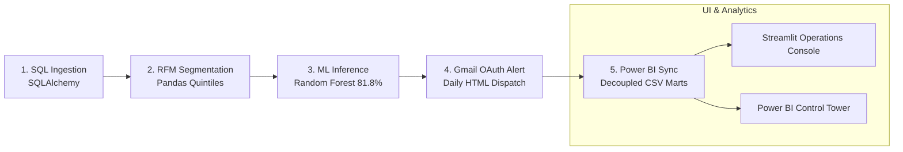

# RetainIQ: Customer Intelligence & Automated Churn Prevention Engine

> **End-to-End Enterprise MLOps Pipeline, Behavioral RFM Loyalty Segmentation, and Automated Real-Time Retention Operations.**

[](https://www.python.org/)
[-orange?logo=scikitlearn&logoColor=white)](https://scikit-learn.org/)
[](https://airflow.apache.org/)
[](https://streamlit.io/)
[](https://powerbi.microsoft.com/)
[](https://opensource.org/licenses/MIT)

---

## 🎯 Executive Overview & Business Value

In high-growth digital retail and e-commerce, customer retention is the primary determinant of long-term unit economics:
* **The 5x–7x Economic Reality**: Acquiring a new customer costs **5 to 7 times more** than retaining an existing one. A modest 5% increase in customer retention can boost corporate profits by **25% to 95%**.
* **The Traditional Bottleneck**: Legacy systems rely on reactive monthly or weekly CSV spreadsheet exports. Companies discover customer churn only after contracts are canceled, revenue is lost, and outreach is too late.
* **The RetainIQ Solution**: RetainIQ transitions organizations from *reactive churn discovery* to **autonomous, daily retention intervention**. The platform ingests fresh transactions, scores behavioral loyalty, runs continuous machine learning inference, and dispatches prioritized customer rescue queues to sales managers within 24 hours.

| Dimension | Traditional Legacy Approach | RetainIQ Modern Engine |
| :--- | :--- | :--- |
| **Ingestion** | Monthly manual CSV dumps prone to human delay. | Autonomous daily batch ingestion into relational SQL. |
| **Customer Scoring** | Static spreadsheets with zero behavioral weighting. | Statistical RFM Quintile Modeling (11 loyalty personas). |
| **Churn Prediction** | Reactive: Discovered after revenue loss. | Proactive: Tuned Random Forest (81.8% Acc, 0.86 ROC-AUC). |
| **Decision Threshold** | Arbitrary 50% cutoff (high false-alarm rate). | High-ROI $\ge 80\%$ Crisis Cutoff isolating 339 top accounts. |
| **Alerting** | Ad-hoc emails sent manually days later. | Automated priority HTML report dispatched via Gmail OAuth within 24h. |
| **Orchestration** | Brittle cron scripts with no retry logic. | Apache Airflow 2.x TaskFlow DAG with exponential backoff. |
| **BI Reporting** | Heavy database queries causing table lockups. | Decoupled CSV analytical data mart (sub-second refresh). |

---

## 🏗️ System Architecture & Execution Flow

RetainIQ executes an automated 5-stage sequential workflow engineered for high throughput and complete task isolation:



1. **Task 1: SQL Data Ingestion (`src/etl/ingest.py`)**:
   Pulls raw e-commerce customer transaction records, enforces schema constraints, and maintains relational integrity for 5,630 baseline accounts.
2. **Task 2: RFM Feature Engineering (`src/etl/feature_engineering.py`)**:
   Calculates statistical quintiles across **Recency** (days since last order), **Frequency** (lifetime order count), and **Monetary** (cashback/spend). Categorizes customers into 11 strategic loyalty personas (*Champions, Loyal Customers, Potential Loyalists, At Risk, Can't Lose Them, Hibernating, etc.*). Imputes missing numerical values with medians and applies one-hot encoding.
3. **Task 3: Machine Learning Inference (`src/ml/inference.py`)**:
   Loads the trained Random Forest artifact (`models/churn_model.pkl`), evaluates continuous risk probabilities (`predict_proba` from 0% to 100%), and assigns dynamic risk tiers (High $\ge 80\%$, Medium $50-79\%$, Low $<50\%$).
4. **Task 4: High-Risk Alert Dispatch (`src/alerts/gmail_alert.py`)**:
   Filters accounts in the critical $\ge 80\%$ crisis tier (339 accounts), formats a prioritized HTML operational briefing with direct action playbooks, and dispatches it via Google Gmail OAuth 2.0 API with full delivery audit logging.
5. **Task 5: Decoupled BI Export (`run_pipeline.py`)**:
   Exports clean, pre-aggregated analytical SQL views (`v_daily_action_queue.csv`, `v_executive_kpis.csv`, `v_churn_drivers.csv`) to `data/processed/`. Power BI Desktop and Streamlit reload these static files in under 1 second without database locks.

---

## 📊 Proven Dataset Metrics & Power BI Findings

All findings are verified and reproducible across the baseline dataset of **5,630 customer accounts**:

* **Portfolio Health**:
  * **5,630 Total Customers Monitored** in SQL database.
  * **86.31% Portfolio Retention Rate** (13.69% historical attrition).
  * **339 High-Risk Accounts** strictly exceeding the $\ge 80\%$ churn risk threshold.
  * **$54,300+ in Direct Cashback Incentives at Immediate Risk** within the 339 crisis accounts alone.
* **Model Diagnostic Power**:
  * **81.8% Classification Accuracy** on hold-out validation splits.
  * **0.86 ROC-AUC Score**, proving strong ranking fidelity to separate leaving customers from loyal ones.
* **Root-Cause Attrition Insights**:
  * **The Month 0–6 Onboarding Cliff**: Customer churn risk spikes above **40%** in the first 6 months before stabilizing below 10%–15% once accounts pass month 10.
  * **Product Category Risk**: *Grocery* leads category attrition at **16.0%**, followed by *Laptop & Accessory* (**13.9%**), *Fashion* (**13.5%**), and *Mobile Phone* (**11.4%**).

---

## 💻 Streamlit Operations Console (`app.py`)

For non-technical business managers, RetainIQ includes an interactive web application:
* **Tab 1 (Executive Overview)**: Portfolio KPI cards and interactive Plotly diagnostics matching the Power BI Control Tower.
* **Tab 2 (High-Priority Action Queue)**: Widescreen view of high-risk customers with dynamic risk threshold sliders ($\ge 80\%$), search filters, action playbooks, and a 1-click email dispatch button.
* **Tab 3 (Airflow Automation & Scheduler)**: Real background daemon monitoring the system clock, interactive 1-click batch simulation (+35 incoming accounts), and deterministic cron triggers (`0 6 * * *`).
* **Tab 4 (Alert Inspector)**: Responsive HTML email preview of the actual alert dispatched to stakeholders, paired with an interactive recipient manager (supporting manual editing and bulk employee CSV upload).

---

## 🚀 Quick Start & Installation

### 1. Clone the Repository
```bash
git clone https://github.com/Uday2kranth/RetainIQ-Customer-Intelligence-Engine.git
cd RetainIQ-Customer-Intelligence-Engine
```

### 2. Set Up Virtual Environment & Dependencies
```bash
# Create virtual environment
python -m venv .venv

# Activate environment (Windows PowerShell)
.\.venv\Scripts\activate

# Install all production dependencies
pip install -r requirements.txt
```

### 3. Launch the Streamlit Operations Console
```bash
python -m streamlit run app.py --server.port 8501
```
*Access in your browser at `http://localhost:8501`.*

---

## ⚙️ Running the Master Pipeline (Standalone CLI)

If you prefer headless command-line execution without Streamlit:

```bash
# 1. Standard Daily Run (Baseline 5,630 Accounts)
python run_pipeline.py

# 2. Incremental Batch Simulation (+35 Incoming Accounts for Live Power BI Refresh)
python run_pipeline.py --simulate

# 3. Instant Reset Switch (Wipes Simulation & Restores 5,630 Baseline)
python run_pipeline.py --reset
```

### 🧪 Automated Test Suite
Verify all 5 pipeline layers with automated integration tests:
```bash
pytest tests/test_pipeline_e2e.py -v
```
*(7 passed with 100% pass rate in ~4.1 seconds).*

---

## 📂 Project Repository Structure

```
RetainIQ-Customer-Intelligence-Engine/
├── .streamlit/                # Streamlit theme configuration
├── app.py                     # Streamlit Executive Operations Console
├── dags/
│   └── retainiq_pipeline_dag.py # Apache Airflow 2.x TaskFlow DAG
├── data/
│   ├── raw/                   # Immutable raw Kaggle e-commerce transactions
│   └── processed/             # Decoupled analytical CSV & Parquet marts
├── docs/                      # Technical documentation & Power BI guides
├── models/
│   ├── churn_model.pkl        # Tuned Random Forest model artifact
│   └── model_metrics.json     # Model evaluation benchmarks
├── powerbi/
│   ├── RetainIQ_Control_Tower.pbix # Single-pane-of-glass Power BI dashboard
│   ├── dax_measures.dax       # Core DAX business formulas
│   └── powerbi_views.sql      # Analytical SQL reporting views
├── scripts/
│   ├── schedule_demo.py       # Standalone OS clock background scheduler daemon
│   ├── build_html_study_pack.py
│   └── build_spa_study_app.py
├── src/
│   ├── alerts/gmail_alert.py  # Google Gmail OAuth 2.0 alerting engine
│   ├── db/connection.py       # SQLAlchemy database engine
│   ├── db/schema.py           # Relational schema definition
│   ├── etl/ingest.py          # Data ingestion & batch simulation
│   ├── etl/feature_engineering.py # RFM quintiles & cleaning
│   └── ml/inference.py        # Model scoring & risk prediction
├── study_pack/                # Standalone mobile study application
├── tests/
│   └── test_pipeline_e2e.py   # Automated end-to-end integration test suite
├── .gitignore                 # Enterprise credentials & media protection
├── requirements.txt           # Verified package dependencies
└── README.md                  # Project documentation
```

---

## 👥 Academic & Project Attribution

* **Lead Analytics Architect & Developer**: **Pendyala Uday Kranth**
* **Cohort Program**: Batch G1 — Data Analytics
* **Project Mentorship**: **Nithyasri kannathal EL** (Senior Product Engineer, Espergroup)
* **Institution / Organization**: **SURE Trust ProEd** *(formerly SURE Trust)*
* **Live Study Pack & Documentation Portal**: [https://uday2kranth.github.io/project_details_and_documetation/](https://uday2kranth.github.io/project_details_and_documetation/)

---

## 📜 License
This project is licensed under the MIT License — see the [LICENSE](LICENSE) file for details.
