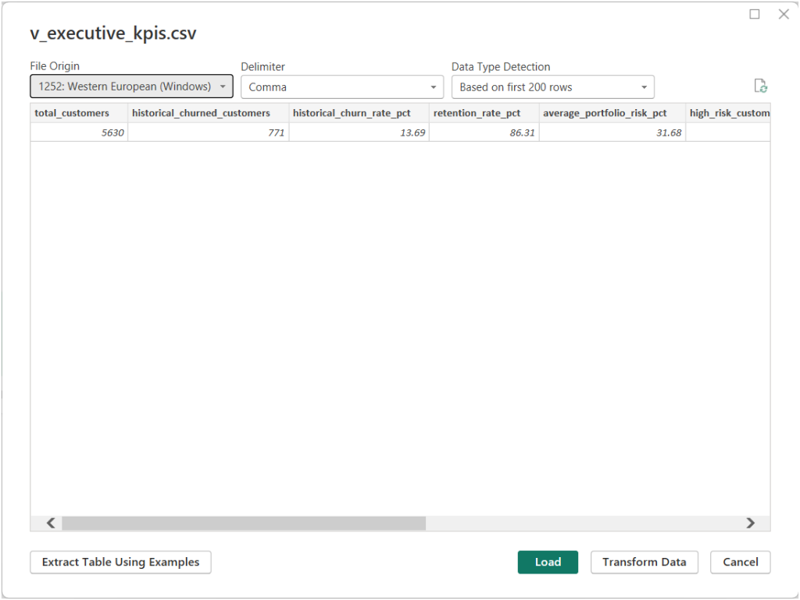
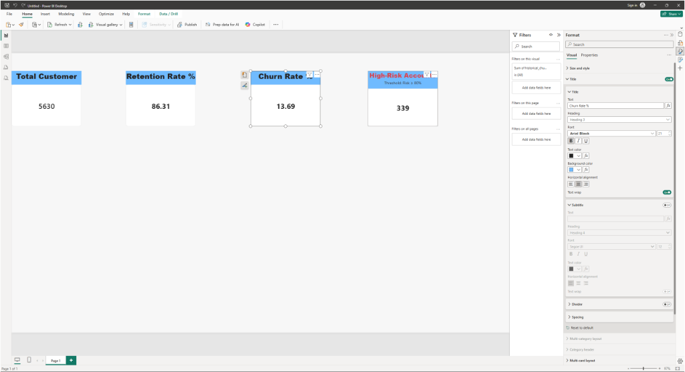
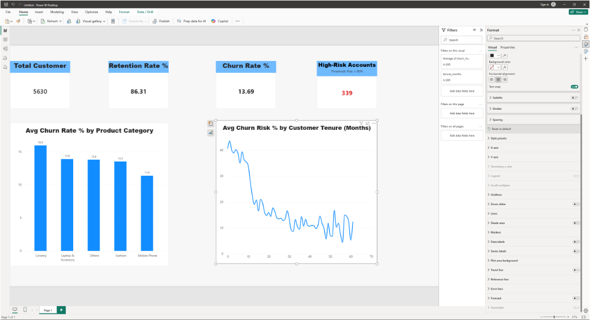
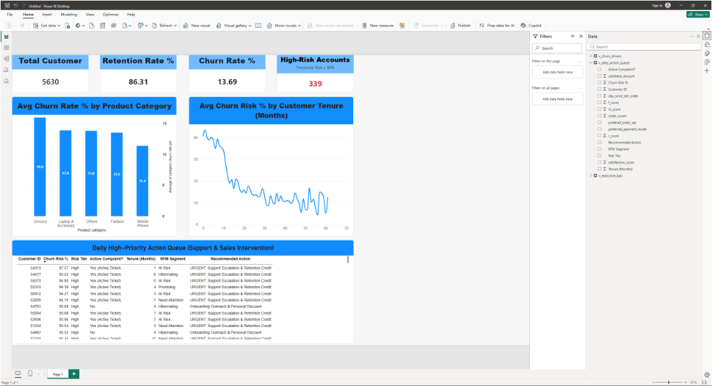

# 📊 RetainIQ Power BI Control Tower: Live Step-by-Step Build Guide

> **Document Purpose**: Single source of truth for constructing the RetainIQ Power BI Desktop dashboard. Updated live as we complete each step or adjust settings for modern Power BI Desktop.

---

## 🧭 Master Progress Tracker

| Stage | Section | Target Visual | Status |
| :---: | :--- | :--- | :---: |
| **0** | **Data Loading** | Load `v_executive_kpis`, `v_daily_action_queue`, `v_churn_drivers` | ✅ **COMPLETED** |
| **1** | **Top Row (Cards)** | Card 1: Total Customers (`5,630`) | ✅ **COMPLETED** |
| | | Card 2: Retention Rate (`86.31%`) | ✅ **COMPLETED** |
| | | Card 3: Churn Rate (`13.69%`) | ✅ **COMPLETED** |
| | | Card 4: High-Risk Accounts (`339` in Red) | ✅ **COMPLETED** |
| **2** | **Middle Row (Charts)**| Chart 1: Churn by Product Category (Bar Chart) | ✅ **COMPLETED** |
| | | Chart 2: Churn Risk by Customer Tenure (Line Chart) | ✅ **COMPLETED** |
| **3** | **Bottom Row (Table)** | Daily Action Queue Operational Table | 🔄 **IN PROGRESS** |
| **4** | **Polish & Save** | Layout alignment, title banner, save `.pbix` | ⏳ Pending |
| **5** | **Live Presentation** | 1-Click Refresh demo test | ⏳ Pending |

---

## 🛠️ Step-by-Step Execution Plan

### Section 0: Data Import (Status: ✅ COMPLETED)
- Loaded `v_executive_kpis.csv`
- Loaded `v_daily_action_queue.csv`
- Loaded `v_churn_drivers.csv`



---

### Section 1: Row 1 — Executive KPI Cards (Status: ✅ COMPLETED)

> [!NOTE]
> **Power BI Interface Note**: You are using the **New Card visual** (`Visual` tab with `Callout` groupings).

#### 🔹 Card 1: Total Customers
- **Target Value**: `5,630`
- **Source Field**: `v_executive_kpis[total_customers]`
- **Formatting Checklist**:
  1. Title turned **On**: text set to `Total Customers`.
  2. In **Format** $\rightarrow$ **Visual** $\rightarrow$ **Callout** $\rightarrow$ click **`> Value`**:
     - Change **Display units** from `Auto` to **`None`** (turns `5.630K` into `5,630`).
  3. In **Format** $\rightarrow$ **Visual** $\rightarrow$ **Callout** $\rightarrow$ turn **`Label`** switch **`Off`** (removes `Sum of total_customers`).
  4. Resize card to a compact rectangle occupying top-left corner (~22% canvas width).

#### 🔹 Card 2: Customer Retention Rate
- **Target Value**: `86.31%`
- **Source Field**: `v_executive_kpis[retention_rate_pct]`
- **Formatting Checklist**:
  1. Add Card visual right next to Card 1.
  2. Set Title to: `Retention Rate %`.
  3. Under `Callout` $\rightarrow$ `> Value`: set **Display units** to `None`, decimal places to `2`.
  4. Turn `Label` switch **`Off`**.
  5. Value color: Forest Green (`#16A34A`).

#### 🔹 Card 3: Historical Churn Rate
- **Target Value**: `13.69%`
- **Source Field**: `v_executive_kpis[historical_churn_rate_pct]`
- **Formatting Checklist**:
  1. Add Card visual right next to Card 2.
  2. Set Title to: `Churn Rate %`.
  3. Under `Callout` $\rightarrow$ `> Value`: set **Display units** to `None`, decimal places to `2`.
  4. Turn `Label` switch **`Off`**.

#### 🔹 Card 4: High-Risk Accounts (Urgent Priority)
- **Target Value**: `339` (in Crimson Red `#DC2626`)
- **Source Field**: `v_executive_kpis[high_risk_customers_count]`
- **Formatting Checklist**:
  1. Add Card visual on far right of Row 1.
  2. **Title**: `High-Risk Accounts` (Font size: `15pt`).
  3. **Subtitle**: `Threshold: Risk ≥ 80%` (Font size: `11pt`, muted gray).
  4. Under `Callout` $\rightarrow$ `> Value`: set **Display units** to `None`.
  5. Under `Callout` $\rightarrow$ `> Value` $\rightarrow$ **Color**: Crimson Red (`#DC2626`).
  6. Turn `Label` switch **`Off`**.



---

### Section 2: Row 2 — Diagnostic Charts (Status: ✅ COMPLETED)

#### 🔹 Chart 1: Churn Exposure by Product Category (Status: ✅ COMPLETED)
- **Visual Type**: Clustered Column Chart (Vertical columns)
- **Source Table**: `v_churn_drivers`
- **Axes Configuration**:
  - **X-Axis**: `prefered_order_cat` (Grocery, Laptop & Accessory, Others, Fashion, Mobile Phone)
  - **Y-Axis**: `category_churn_rate_pct` (Aggregation: **Average**)
- **Data Labels**: Turned **On** (shows 16.0%, 13.9%, 13.8%, 13.5%, 11.4% on top of bars)
- **Title**: `Avg Churn Rate % by Product Category`

#### 🔹 Chart 2: Churn Probability by Customer Tenure (Status: ✅ COMPLETED)
- **Visual Type**: **Line Chart** (Continuous trendline)
- **Source Table**: `v_daily_action_queue`
- **Axes Configuration**:
  - **X-Axis**: `tenure_months`
  - **Y-Axis**: `churn_risk_pct` (Aggregation: **Average**)
- **Data Labels**: Kept **Off** (to prevent 60 overlapping text values)
- **Title**: `Avg Churn Risk % by Customer Tenure (Months)`
- **Key Insight**: Shows high churn risk (~40%+) for new accounts (0–6 months), flattening as customer relationships mature.




---

### Section 3: Row 3 — Daily Action Queue Table (Status: ✅ COMPLETED)

> **Design Choice**: 1-Page "Single-Pane-of-Glass" Executive Dashboard. All cards and charts are compacted vertically to allow the operational table to anchor the bottom 35% of the screen.

- **Visual Type**: **Table** visual (Spans 100% canvas width across the bottom).
- **Source Table**: `v_daily_action_queue`

#### Step 1: Clean Up Column Names in the Data Pane (Most Efficient Method)
Before or right after adding columns to the table, rename them directly in the **Data Pane** on the right side so they display professional, human-readable labels without underscores everywhere:
1. If the **Data Pane** is hidden, click the **View** tab in the top ribbon and check **Data**.
2. Expand `v_daily_action_queue`.
3. Right-click each column (or double-click its name) $\rightarrow$ select **Rename**:
   - `customer_id` $\rightarrow$ **`Customer ID`**
   - `churn_risk_pct` $\rightarrow$ **`Churn Risk %`**
   - `risk_tier` $\rightarrow$ **`Risk Tier`**
   - `complaint_status` $\rightarrow$ **`Active Complaint?`**
   - `tenure_months` $\rightarrow$ **`Tenure (Months)`**
   - `rfm_segment` $\rightarrow$ **`RFM Segment`**
   - `recommended_action` $\rightarrow$ **`Recommended Action`**

#### Step 2: Add Columns to the Table & Fix Aggregation
Add the renamed fields into the Table's **Columns** well in this exact order:
1. `Customer ID`
2. `Churn Risk %`
3. `Risk Tier`
4. `Active Complaint?`
5. `Tenure (Months)`
6. `RFM Segment`
7. `Recommended Action`

> [!IMPORTANT]
> **Set Aggregations to "Don't Summarize":**
> Power BI automatically tries to calculate the `Sum` of numeric columns. For `Customer ID`, `Churn Risk %`, and `Tenure (Months)`:
> - Click the small down arrow ($\vee$) next to the field in the **Columns** well.
> - Select **Don't summarize**.
> This forces Power BI to list each customer record individually instead of adding them together into a single total row!

#### Step 3: Sort by Highest Risk
- Click once directly on the **`Churn Risk %`** column header inside the table on the canvas.
- Ensure the arrow points down ($\downarrow$), sorting from highest risk (e.g. `97.57%`) to lowest risk.

#### Step 4: Visual Formatting
- **Title Banner**: Turn **Title = On** $\rightarrow$ Text: `Daily High-Priority Action Queue (Support & Sales Intervention)` $\rightarrow$ Font Color: White $\rightarrow$ Background Color: Solid Blue (matching KPI cards).
- **Column Headers**: Under `Format > Visual > Column headers`, set Font to **Bold** for strong contrast.



---

### Section 4: Polish & Save (Status: ✅ COMPLETED)

#### 1. Visual Polish Checklist
- **Card 1 Consistency**: In the first KPI card, rename the title to **`Total Customers`** (plural) to match `High-Risk Accounts`.
- **Chart 1 (Category Breakdown)**:
  - Data labels enabled inside bars in bold (`16.0%`, `13.9%`, etc.).
  - X-axis labeled as `Product category` without underscores.
  - Y-axis placed cleanly on the right or hidden.
- **Chart 2 (Tenure Trendline)**:
  - Continuous retention decay curve from 0 to 70 months.
- **Table (Action Queue)**:
  - Clean column headers with zero underscores, sorted descending by churn risk (`97.57%` on top).

#### 2. Save the Power BI Report
1. In Power BI Desktop, click **File > Save As**.
2. Navigate to your project folder:
   `d:\important_cmd_history\project fopr suretrust\powerbi\`
3. Save as: **`RetainIQ_Control_Tower.pbix`**

#### 3. Test Live Automation (The "1-Click Refresh" Demo)
1. Open PowerShell terminal in VS Code.
2. Run the end-to-end pipeline:
   ```powershell
   python run_pipeline.py
   ```
3. In Power BI Desktop, click the **Home > Refresh** button in the ribbon.
4. Watch all cards, charts, and table rows refresh instantly from the local SQLite/CSV pipeline!

